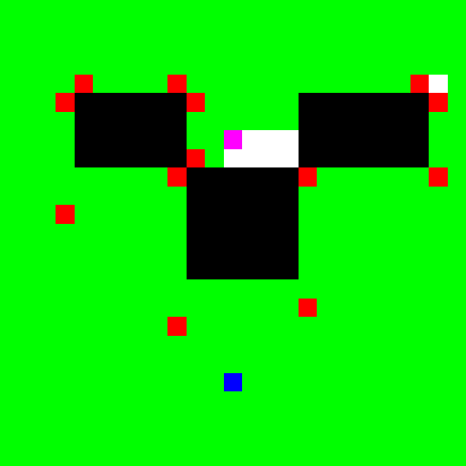

# PathPlanningProject
Проект НИУ ВШЭ по планированию траекторий

[](https://travis-ci.com/pomo-mondreganto/PathPlanningProject)
[](https://ci.appveyor.com/project/pomo-mondreganto/pathplanningproject)


## Требования

Для сборки и запуска возможно использовать QMake или CMake. CMakeLists.txt и .pro файлы доступны в репозитории. Для проведения тестирования локально испольщуйте CMake. Подробные требования к ПО указаны ниже. 

### Linux
- Git 2.7.4 или выше
- CMake 3.2 или выше;
- GCC 7.1 или выше;
- Make

### Mac
- Git 2.23.0 или выше
- CMake 3.16.1 или выше;
- Apple LLVM version 11.0.0 (clang-1100.0.33.16) или выше;
- Make

### Windows
- Git 2.23.0 или выше
- CMake 3.2 или выше;
- MinGW-w64 5.0.3 или выше (должен быть добавлен в переменную среды Path);

Сборку проекта возможно осуществить используя CMake.
  
### Linux и Mac
Release сборка:
```bash
cd PathPlanningProject
cd Build
cd Release
cmake ../../ -DCMAKE_BUILD_TYPE="Release"
make
make install
```

Debug сборка:
```bash
cd PathPlanningProject
cd Build
cd Debug
cmake ../../ -DCMAKE_BUILD_TYPE="Debug"
make
make install
```

Запуск:
```bash
cd ../../Bin/{Debug|Release}/
./PathPlanning ../../Examples/example.xml
```
Результат запуска:


### Windows
Release сборка:
```cmd
cd PathPlanningProject
cd Build
cd Release
set PATH
cmake ../../ -DCMAKE_BUILD_TYPE="Release" -G "MinGW Makefiles"
mingw32-make
mingw32-make install
```

Debug сборка:
```cmd
cd PathPlanningProject
cd Build
cd Debug
set PATH
cmake ../../ -DCMAKE_BUILD_TYPE="Debug" -G "MinGW Makefiles"
mingw32-make
mingw32-make install
```

Запуск:
```cmd
cd ../../Bin/{Debug|Release}/
PathPlanning.exe ../../Examples/example.xml
```

Результат запуска:


## Опции 

Входные данные подаются программе первым аргументом командной строки, в котором должен быть указан 
путь к XML-файлу. Поддерживаемые опции:

- `root`: корневой элемент, содержит все остальные опции
  - `map`: описание входного графа-карты
    - `width`: ширина карты
    - `height`: высота карты
    - `cellsize`: "расстояние" между соседними клетками карты
    - `startx`: x-кооордината стартовой точки
    - `starty`: y-кооордината стартовой точки
    - `finishx`: x-кооордината конечной точки
    - `finishy`: y-кооордината конечной точки
    - `grid`: сам граф-карта
      - `row`: строка карты, должен быть указан `height` раз, в каждой строке `width` разделенных 
       пробелами чисел 0/1, заблокирована клетка или нет
  - `algorithm`: описание алгоритма, который нужно запустить
    - `searchtype`: тип поиска, поддерживаются `astar`, `dijkstra` или `jp_search`
    - `metrictype`: тип метрики (для эвристики `astar`, поддерживаются `diagonal`, `manhattan`, 
    `euclidean` и `chebyshev`
    - `breakingties`: опция `star`, определяющая порядок раскрытия вершин при равных `F`-значениях, 
    поддерживаются `g-min` и `g-max` (выбирается вершина с наименьшим/наибольшим `g`-значением 
    соответственно)
    - `hweight`: вес эвристики для `astar`
    - `allowdiagonal`: разрешены ли переходы по диагонали (`true`/`false`). Пример перехода 
    (из точки 1 в точку 2, звездочками обозначены препятствия, здесь и далее) в конце описания опций
    - `cutcorners`: разрешены ли переходы по диагонали при одной заблокированной смежной клетке 
    (`true`/`false`).
    - `allowsqueeze`: разрешены ли переходы по диагонали при двух заблокированных смежных клетках 
        (`true`/`false`). 
  - `options`: дополнительные опции
    - `loglevel`: уровень логгирования, число от `0` до `2` с шагом `0.5`, больше число, больше 
    информации
    - `logpath`: путь к файлу с логом, по умолчанию текущая директория
    - `logfilename`: название файла с логом, по умолчанию `<input>_log.xml`   

#### Описание переходов:

- `allowdiagonal`:

```
.2
1.
```

- `cutcorners`:

```
.2
1*
```

- `allowsqueeze`:

```
*2
1*
```

*Обратите внимание*, что в случае алгоритма JPS (`jp_search`), значения переходов не учитываются,
при этом считается, что `allowdiagonal=true`, `cutcorners=true`, `allowsqueeze=false`.

## Сравнение алгоритмов

На картинках показано явное сравнение производительности алгоритмов:

---
Алгоритм Дейкстры. Синим выделена точка старта, розовым выделена точка финиша. Красным выделены все 
рассмотренные вершины (добавленные в список OPEN).


 
---

Алгоритм A*. Цвета аналогичны алгоритму Дейкстры.


---

Алгоритм JPS. Красным выделены вершины, помещенные в список OPEN, зеленым выделены все рассмотренные 
вершины. Из-за маленького числа асимптотически долгих операций добавления в список OPEN алгоритм 
быстрее находит путь.




## Тестирование 

При использовании сборки CMake возможен запуск тестов, как локально, так и с использованием Travis CI и AppVeyor. 
Локальный запуск тестов производится из директории `.../PathPlanningProject/Build/{Debug|Release}/` с помощью команды:
```
 ctest
```

либо (для более подробного вывода):
```
 ctest --output-on-failure
```

## Контакты
**Яковлев Константин Сергеевич** (ментор)
- kyakovlev@hse.ru
- [Сайт НИУ ВШЭ](https://www.hse.ru/staff/yakovlev-ks)
- Telegram: @KonstantinYakovlev
  
**Дергачев Степан**
- sadergachev@edu.hse.ru
- Telegram: @haiot4105
